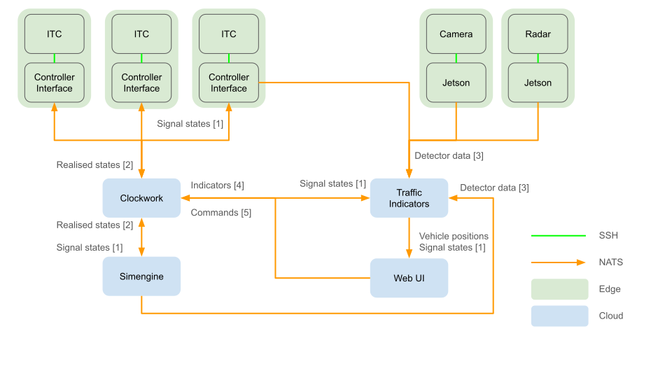

# Architecture

This document provides an overview of the entire Open Controller's architecture.
Note that this is just an overview of the [components](#components) and their
[relationships](#communications). For more information, check out the README's under
each service (e.g. `services/control_engine/README.md`).

## Components

Open Controller consists of multiple components that all run in their own containers.
The separation simplifies moving from simulation to the field, and deploying Open
Controller in different environments.



> Figure 1: Architecture diagram of Open Controller and its components. The arrows
represent communication channels.

### Simengine

Simengine is the simulation runner of Open Controller. It starts and manages a
[SUMO](https://sumo.dlr.de/docs/index.html) simulation in the container. Simengine's
main purpose is to pass signal states from Clockwork to the simulator, send detector
data to Traffic Indicators, and provide a graphical user interface for the simulation.

#### Interactions

**Sends:** [realised group states](#realised-states), [detector data](#detections)  
**Consumes:** [signal group states](#signal-states)

### Clockwork

Clockwork is the controller part of Open Controller. It uses the abstract signal
controllers from `services/control_engine/src/signal_controller.py` to publish
[signal states](#signal-states) to NATS. Depending on the environment, the controllers
might use native SUMO detectors or actual [Traffic Indicators](#traffic-indicators)
detectors to decide the signal states.

Clockwork can be turned on and off with [commands](#controller-commands) by other
services. The status of Clockwork can be queried with requests to
[clockwork status](#clockwork-status).

#### Interactions

**Sends:** [signal group states](#signal-states)  
**Consumes:** [traffic data](#traffic-indicators-data),
[controller commands](#controller-commands)  
**Responds to:** [clockwork status](#clockwork-status)

### Traffic Indicators

Traffic Indicators processes raw detector data to actionable traffic numbers. It uses
sensor fusion to improve the reliability of the detections by combining the readings
of multiple data sources into a single digital twin. If possible, Traffic Indicators
assigns all detected vehicles an ID, and tries to figure out the type of the vehicle
(e.g. car, truck, bus).

Traffic Indicators runs as its own container to separate it from other components of
Open Controller. It is designed to be able to utilize data from very different sources,
and be used itself by various consumers. Most notably, Traffic Indicators is used by
[Clockwork](#clockwork).

Traffic Indicators is also agnostic to the environment it operates in. It can receive
data from real life radars or simulated detections from
[simulation engine](#simengine). The data is processed in exactly the same way, no
matter where it came from. This also simplifies the downstream consumption of the data,
as the consumer doesn't need to know the origin of the data.

#### Interactions

**Sends:** [traffic data](#traffic-indicators-data)  
**Consumes:** [detector data](#detections), [realised states](#realised-states)

### WebSUMO

WebSUMO is a browser-based viewer for the running simulation. Simengine
publishes the simulation state (vehicles, persons, signal states, detector
occupancy) over NATS on the `sim.<scenario>.*` subjects, and serves the
scenario's network and detector files over NATS request-reply, so the viewer
needs no scenario files of its own. The viewer is strictly an observer: it
never controls the simulation, and the simulation runs unaffected if the
viewer (or the whole NATS connection) is absent.

The WebSUMO viewer itself lives in its own repository
([Open-TLC/websumo](https://github.com/Open-TLC/websumo)); the container
build clones it at a pinned commit. The interface and its subjects are
described in
[services/simengine/doc/websumo.md](../services/simengine/doc/websumo.md).

#### Interactions

**Consumes:** simulation state (`sim.<scenario>.state`), scenario files
(request-reply on `sim.<scenario>.net` / `.detectors`)

### User Interface

The user interface is a browser-based dashboard (port 8050) for monitoring
Open Controller. It follows the message traffic on NATS (signal states,
detections) and the [status of Clockwork](#clockwork-status).

#### Interactions

**Consumes:** [signal group states](#signal-states),
[detector data](#detections), [clockwork status](#clockwork-status)

## Communications

Open Controller is built around [NATS](https://nats.io), a high performance pub-sub
and messaging platform. The distributed components of Open Controller publish and
subscribe to different message subjects and the NATS server takes care of the message
delivery. In Open Controller, all NATS messages are JSON objects.

Here is a breakdown of messaging subjects and message formats used in Open Controller.
The numbers reference the communication channels in Figure 1.

### Signal states

> Nro. 1

Signal states desired by the control logic. These are the bread and butter of Open
Controller. They are sent by Clockwork, and consumed by the edge controller interfaces
or the Simengine. Signal states are sent per signal group, meaning that you can
subscribe to all states for a single group or an entire controller.

**Subject:** `group.control.<controller ID>.<group number>`  
**Format:**

```json
{
    "id": "group.control.<controller ID>.<group number>",
    "tstamp": "YYYY-MM-DDTHH:MM:SS.SSSSSSSSS",
    "substate": "5",
    "group": 3,
    "green": true
}
```

Note that the time stamp should be ISO 8601 string with 9 digits (nanosecond) precision.

### Realised states

> Nro. 2

Signal states actually executed by the ITC interface / Simengine. If everything goes
well, the sub states here should match the [control states](#signal-states).

**Subject:** `group.status.<controller ID>.<group number>`  
**Format:**

```json
{
    "id": "group.status.<controller ID>.<group number>",
    "tstamp": "YYYY-MM-DDTHH:MM:SS.SSSSSSSSS",
    "substate": "5"
}
```

### Detections

> Nro. 3

Detector statuses read from the simulation (or, in the field, from the real
detectors). Sent by Simengine per detector; depending on the output's
`trigger` configuration a message is sent on every update or only when the
status changes. The subject prefix is configurable (`detector.status` for
plain status distribution, `detector.control` when driving a real
controller's detector inputs in hardware-in-the-loop mode).

Simengine also sends radar object lists on the
`radar.<intersection>.<radar>.objects_port.json` subjects; these are consumed
by Traffic Indicators.

**Subject:** `detector.status.<detector ID>`  
**Format:**

```json
{
    "id": "detector.status.<detector ID>",
    "loop_on": true,
    "tstamp": "YYYY-MM-DDTHH:MM:SS.SSSSSS"
}
```

### Traffic Indicators data

> Nro. 4

Processed traffic numbers computed by Traffic Indicators from the raw
detections, currently the queue lengths per lane in each radar's area. The
subject is derived from the radar's input subject.

**Subject:** `radar.<intersection>.<radar>.queues.json`  
**Format:**

```json
{
    "radar_id": "radar270",
    "queue_lengths": {"0": 2, "1": 0},
    "tstamp": 1756400000000.0
}
```

The time stamp is a millisecond epoch value.

### Controller commands

> Nro. 5

Commands to control Clockwork. With these, you can turn the controller on and off.

**Subject:** `clockwork.command`  
**Format:**

```text
start
```

or

```text
stop
```

### Clockwork status

Clockwork responds to status (like healthcheck) queries with its current working status.

**Subject:** `clockwork.status`  
**Format:**

```text
updating
```

or

```text
idling
```
