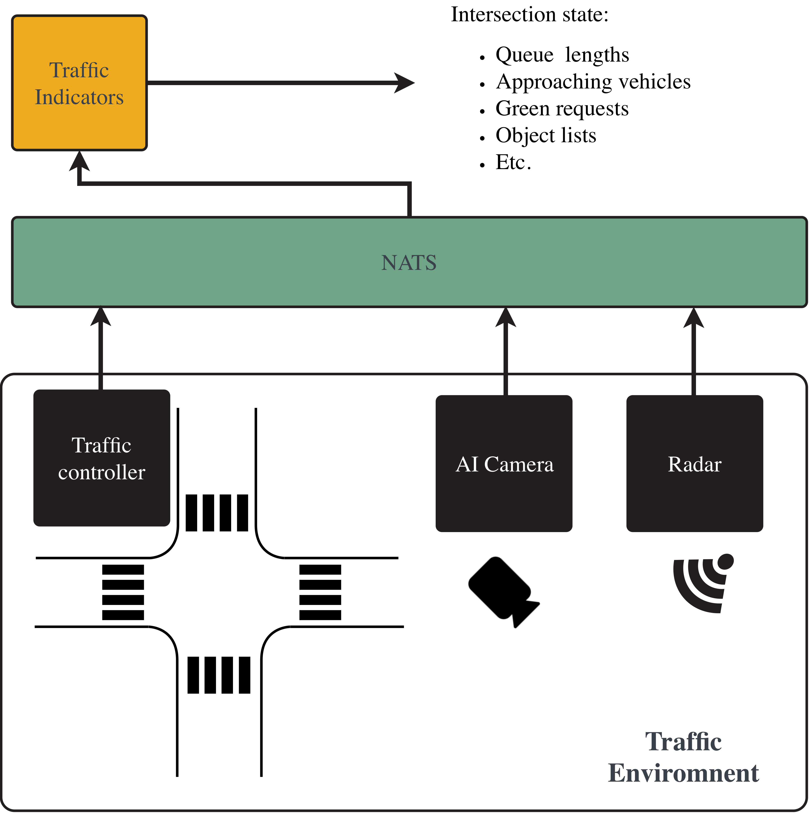
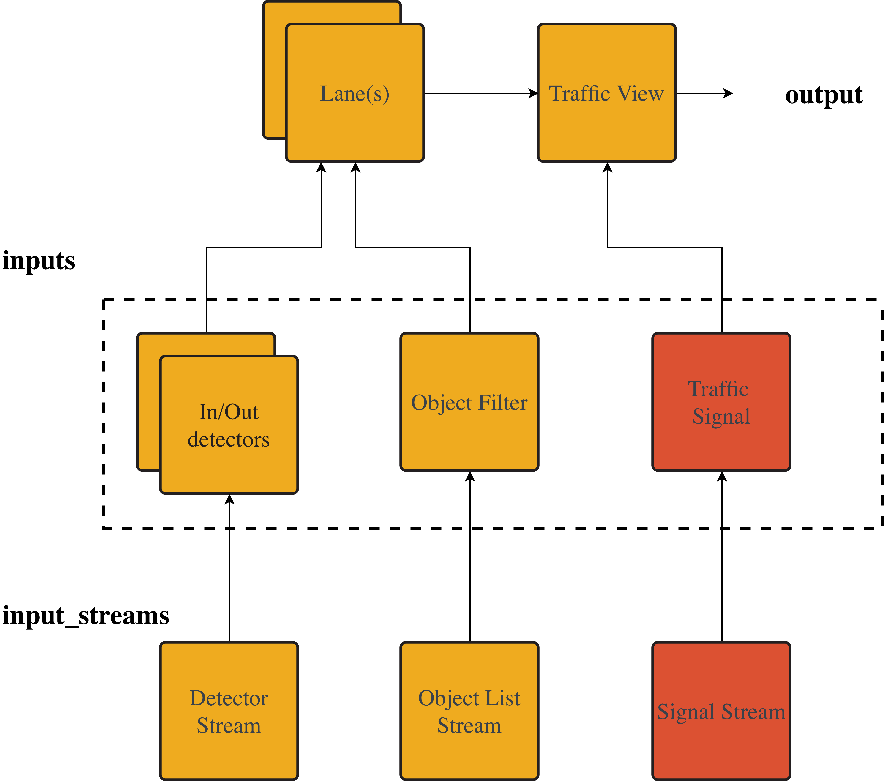

# Traffic indicator configuration

## About
Traffic indicators is a micro service that takes input variables (pre processed data from the traffic environment) calculates relevant traffic indicators (situational awareness) out of it. All inputs and outputs are json-messages and they are relayed using NATS message broker, asi indicated in the following image.



This document describes how the traffic indicators micro service is configured. Conceptually configuration is based on configuring differeent output types and their parameters. Thede are explained in the following chapter. Below output configuration we provide detailed descriptuon of a configuration file and it's sections.

## Output types and configuration
### Traffic indicator outputs

As it stands, traffic indicators provides only one type of an output: "e3". Configuring of this output type is described in the following chapter.

### Traffic view 
#### Traffic viwe and it's ide

Traffic view is an indicator output that tries to estimate the vehicled approaching given traffic signal. One can think it a view the traffic signal "sees" when it ids determining when to change it's state.

We use three different (stream) input types to calculate the output: 1), detector statuses, 2) object lists, and 3) corresponding traffic signal status. These streams are filtered and processed as depicted in the figure below.



#### Imput streams
Three different types of streams are used for the view operations. All of them are deifned in the `input_streams`section of the configuration file. Each of these streams are subscribed to at the start of the traffic indicators operations, and data is processed as it comes.  

**Detector statuses** are in messages indicating if given detector is "occupied" or "not occupied". In practice these are typically loop detectors installed below the pavement indicating if there is a vehicle on top of it. This type of data can be used for making estimates of traffic flow (vehicle counts) crossing the section of the road.

**Signal groups statuses** are stream of messages indicating if a given signal (or signal group) is green or red as well as internal state of the traffic controlled. This infromation can be used when estimating the traffic conditions. 


## Configuration file
### Config file and sections
The purpose of config file is to 1) define connectivity for the service (at the time of the writing, only NATS is available), and 2) define output data we expect from the service, and 3) define inputs needed for the calculation of outputs and how they are connected.


The configuration file is divided into the following sections:

* **Connectivity** - Settings for accessing data sources (currenlty only NATS)
* **input_streams** - Data stream configurations (signals, detectors, radar)
* **detlogics** - Detection logic definitions, not operational yet
* **inputs** - Input definitions (detectors, radar lanes, signal groups)
* **lanes** - Traffic lane configurations
* **outputs** - Output configurations for data publishing


Each of these sections are explained below.

### Connectivity

This section defines the data (stream) connections. In currednt setting we only support NATS connections.

The block is definbed as follows:
```json
{
"connectivity":{
	"notes": "This is for accessing the data",
	"nats": {
		"server": HOSTNAME,
		"port": HOSTPORT
        }
    }
},
```

The section can accept following parameters:

| Variable | Explanation | Example Value |
|----------|-------------|----------------|
| HOSTNAME | The hostname or IP address of the NATS server | "localhost" |
| HOSTPORT | The port number for the NATS server connection | 4222 |


Typical use case is to use nats-server running in the localhost and relaying all the messaging via that.

### Input streams
#### The input stream section
This section defines the input stratms to be used in traffic indicator calculation. There are currently three input stream types available: 1) `groups` for signal statuses, 2) `detectors` for detector inputs, and 3) `radar` for obkject lists. In the following subsections we cover each of them

#### Signal group input stream (`groups`)

Signal group stream is defined with following type of configuration:

```json
    "STREAM_NAME": {
        "connection": "CONNECTION_TYPE",
        "type": "groups",
        "subtype": "SUBTYPE",
        "nats_subject": "SUBSCRIPTION CHANNEL",
        "notes": "DESCRIPTION"
    }

```

Parameters in the sample above takes parameters as follows:

| Variable | Explanation | Example Value |
|----------|-------------|----------------|
| STREAM_NAME | Identifier for the input stream | "sig_inputs" |
| connection | Type of connection protocol | "nats" |
| type | Stream type: `groups` | "groups" |
| subtype | Data source type (e.g., sumo) | "sumo" |
| nats_subject | NATS subject pattern to subscribe to | "group.status.270.*" |
| notes | Description of the stream | "All groups from sumo" |

One should note that typically this stream type subscribes to several different signal group streams (indicated by the `*` at the `nats_subject` example above). The `connection` parameter refers to the `connectivity` section defined in the same configuration file (this is mandatory).

Currently, the subtype has no effect on the operation.

#### Detector input stream (`detectors`)
Detector stream is defined with following type of configuration:

```json
    "STREAM_NAME": {
        "connection": "CONNECTION_TYPE",
        "type": "groups",
        "subtype": "SUBTYPE",
        "nats_subject": "SUBSCRIPITON CHANNEL",
        "notes": "DESCRIPTION"
    }

```
Parameters in the stample above takes parameters as follows:

| Variable | Explanation | Example Value |
|----------|-------------|----------------|
| STREAM_NAME | Identifier for the input stream | "det_inputs" |
| connection | Type of connection protocol | "nats" |
| type | Stream type: `detectors` | "detectors" |
| subtype | Data source type (e.g., sumo) | "sumo" |
| nats_subject | NATS subject pattern to subscribe to |  "detector.status.*" |
| notes | Description of the stream | "All dets from sumo" |

One should note that typically this stream type subscribes to several different detectors streams (indicated by the `*` at the `nats_subject` example above. The `connection`parameter refers to the `connectivity` section defined in the same configuration file (this is mandatory) 

Currently, the subtype has no effect on the operation.


#### Radar input stream (`radar`)

Radar stream is defined with following type of configuration:

```json
    "STREAM_NAME": {
        "connection": "CONNECTION_TYPE",
        "type": "radar",
        "subtype": "SUBTYPE",
        "nats_subject": "SUBSCRIPTION CHANNEL",
        "notes": "DESCRIPTION"
    }

```

Parameters in the sample above takes parameters as follows:

| Variable | Explanation | Example Value |
|----------|-------------|----------------|
| STREAM_NAME | Identifier for the input stream | "radar270.1" |
| connection | Type of connection protocol | "nats" |
| type | Stream type: `radar` | "radar" |
| subtype | Data source type (e.g., sumo) | "sumo" |
| nats_subject | NATS subject for object list subscription | "radar.270.1.objects_port.json" |
| notes | Description of the stream | "Radar pointing north" |

The `connection` parameter refers to the `connectivity` section defined in the same configuration file (this is mandatory).

Currently, the subtype has no effect on the operation.

## Example file

Below is a simplified configuration with full sections. For an operational configuration, see examples under `/models`, for example `models/testmodel/indicators.md`

```json
{
"connectivity":{
	"notes": "This is for accessing the data",
	"nats": {
		"server": "localhost",
		"port": 4222
    }
    }
},

"input_streams":{
    "sig_inputs": {
        "connection": "nats",
        "type": "groups",
        "subtype": "sumo",
        "nats_subject": "group.status.270.*",
        "notes": "Will subscribe to all groups sent by sumo"
    },
    "det_inputs": {
        "connection": "nats",
        "type": "detectors",
        "subtype": "sumo",
        "nats_subject": "detector.status.*",
        "notes": "Will subscribe to all detectors sent by sumo"
        },    
    "radar270.1": {
        "connection": "nats",
        "type": "radar",
        "subtype": "sumo",
        "nats_subject": "radar.270.1.objects_port.json",
        "notes": "Will subscribe to radar pointing north"
        },
    "radar270.2": {
        "connection": "nats",        
        "type": "radar",
        "subtype": "sumo",
        "nats_subject": "radar.270.2.objects_port.json",
        "notes": "Will subscribe to radar pointing west"
        },
    "radar270.3": {
        "connection": "nats",
        "type": "radar",
        "subtype": "sumo",
        "nats_subject": "radar.270.3.objects_port.json",
        "notes": "Will subscribe to radar pointing south"
        }
    },

"detlogics":{
    "tram9_request_detlogic":{
        "type": "two_det_switch",
        "notes": "One detector swithces the request on, another off",
        "detectors": {
            "request": "R8PY",
            "clear": "R8KU"
        },
        "request_trigger": "rising_edge",
        "clear_trigger": "falling_edge"
        }
    },

"inputs":{
    "dets":{
        "2-002": {
            "type": "falling_edge",
            "stream": "det_inputs",
            "name": "2-002"
        },
        "2-040": {
            "type": "rising_edge",
            "stream": "det_inputs",
            "name": "2-040"
        },
        "5-002": {
            "type": "falling_edge",
            "stream": "det_inputs",
            "name": "5-002"
        },
        "5-040": {
            "type": "rising_edge",
            "stream": "det_inputs",
            "name": "5-040"
        },
        "1-002": {
            "type": "falling_edge",
            "stream": "det_inputs",
            "name": "1-002"
        },
        "1-040": {
            "type": "rising_edge",
            "stream": "det_inputs",
            "name": "1-040"
        },
        "6-002A": {
            "type": "falling_edge",
            "stream": "det_inputs",
            "name": "6-002A"
        },
        "6-040": {
            "type": "rising_edge",
            "stream": "det_inputs",
            "name": "6-040"
        },
        "6-002B": {
            "type": "falling_edge",
            "stream": "det_inputs",
            "name": "6-002B"
        },
        "6-030": {
            "type": "rising_edge",
            "stream": "det_inputs",
            "name": "6-030"
        },
        "7-020": {
            "type": "rising_edge",
            "stream": "det_inputs",
            "name": "7-020"
        },
        "7-001": {
            "type": "falling_edge",
            "stream": "det_inputs",
            "name": "7-001"
        },
        "R8PY": {
            "type": "rising_edge",
            "stream": "det_inputs",
            "name": "R8PY",
            "vtype": "tram_type"
        },
        "R8KU": {
            "type": "rising_edge",
            "stream": "det_inputs",
            "name": "R8KU",
            "vtype": "tram_type"
        },
        "R9PY": {
            "type": "rising_edge",
            "stream": "det_inputs",
            "name": "R9PY",
            "vtype": "tram_type"
        },
        "R9KU": {
            "type": "rising_edge",
            "stream": "det_inputs",
            "name": "R9KU",
            "vtype": "tram_type"
        },
        "R3PY": {
            "type": "rising_edge",
            "stream": "det_inputs",
            "name": "R3PY",
            "vtype": "tram_type"
        },
        "R3KU": {
            "type": "rising_edge",
            "stream": "det_inputs",
            "name": "R3KU",
            "vtype": "tram_type"
        },
        "R4PY": {
            "type": "rising_edge",
            "stream": "det_inputs",
            "name": "R4PY",
            "vtype": "tram_type"
        },
        "R4KU": {
            "type": "rising_edge",
            "stream": "det_inputs",
            "name": "R4KU",
            "vtype": "tram_type"
        },
        "test_request": {
            "type": "rising_edge",
            "stream": "det_inputs",
            "name": "3-002R",
            "vtype": "tram_type"
        },
        "test_clear": {
            "type": "falling_edge",
            "stream": "det_inputs",
            "name": "3-002R",
            "vtype": "tram_type"
        }

    },
    "rad_lanes":{
        "270_1_0": {
            "type": "simple",
            "stream": "radar270.1",
            "lane": "0"
        },
        "270_1_1": {
            "type": "simple",
            "stream": "radar270.1",
            "lane": "1"
        },
        "270_2_0": {
            "type": "simple",
            "stream": "radar270.2",
            "lane": "3"
        },
        "270_3_1": {
            "type": "simple",
            "stream": "radar270.3",
            "lane": "1"
        },
        "270_3_2": {
            "type": "simple",
            "stream": "radar270.3",
            "lane": "0"
        },
        "270_3_3": {
            "type": "simple",
            "stream": "radar270.3",
            "lane": "5"
        }
    },
    "groups": {
        "group1": {
            "type": "simple",
            "stream": "sig_inputs",
            "group": "1"
        },
        "group2": {
            "type": "simple",
            "stream": "sig_inputs",
            "group": "2"
        },
        "group3": {
            "type": "simple",
            "stream": "sig_inputs",
            "group": "3"
        },
        "group4": {
            "type": "simple",
            "stream": "sig_inputs",
            "group": "4"
        },
        "group5": {
            "type": "simple",
            "stream": "sig_inputs",
            "group": "5"
        },
        "group6": {
            "type": "simple",
            "stream": "sig_inputs",
            "group": "6"
        },
        "group7": {
            "type": "simple",
            "stream": "sig_inputs",
            "group": "7"
        },
        "group8": {
            "type": "simple",
            "stream": "sig_inputs",
            "group": "8"
        },
        "group9": {
            "type": "simple",
            "stream": "sig_inputs",
            "group": "9"
        }
    }
},

"lanes":{
    "grp1_1":{
        "name": "Group 1 lane 1",
        "in_dets": ["1-040"],
        "out_dets": ["1-002"],
        "radar_lanes":["270_2_0"],
        "notes": "Approach from west"
    },
    "grp2_1":{
        "name": "Group 2 lane 1",
        "in_dets": ["2-040"],
        "out_dets": ["2-002"],
        "radar_lanes":["270_1_0"],
        "notes": "Approach from north"
    },
    "grp3_1":{
        "name": "Group 3 lane 1",
        "in_dets": ["R3PY"],
        "out_dets": ["R3KU"],
        "radar_lanes":[],
        "lane_main_type": "tram_type",
        "notes": "Tram lane from west"
    },
    "grp4_1":{
        "name": "Group 4 lane 1",
        "in_dets": ["R4PY"],
        "out_dets": ["R4KU"],
        "radar_lanes":[],
        "lane_main_type": "tram_type",
        "notes": "Tram line from north"
    },
    "grp5_1":{
        "name": "Group 5 lane 1",
        "in_dets": ["5-040"],
        "out_dets": ["5-002"],
        "radar_lanes":["270_1_1"],
        "notes": "Approach from north"
    },
    "grp6_1":{
        "name": "Group 6 lane 1",
        "in_dets": ["6-040"],
        "out_dets": ["6-002A"],
        "radar_lanes":["270_3_1"],
        "notes": "Approach from north"
    },
    "grp6_2":{
        "name": "Group 6 lane 2",
        "in_dets": ["6-030"],
        "out_dets": ["6-002B"],
        "radar_lanes":["270_3_2"],
        "notes": "Approach from north"
    },
    "grp7_1":{
        "name": "Group 7 lane 1",
        "in_dets": ["7-020"],
        "out_dets": ["7-001"],
        "radar_lanes":["270_3_3"],
        "notes": "Approach from north"
    },
    "grp8_1":{
        "name": "Tram lane for Group 8",
        "in_dets": ["R8PY"],
        "out_dets": ["R8KU"],
        "radar_lanes":[],
        "lane_main_type": "tram_type",
        "notes": "Special lane for tram"
    },
    "grp9_1":{
        "name": "Tram lane for Group 9",
        "in_dets": ["R9PY"],
        "out_dets": ["R9KU"],
        "radar_lanes":[],
        "lane_main_type": "tram_type",
        "notes": "Special lane for tram"
    },
    "tramtest": {
        "name": "Tram test lane",
        "in_dets": ["test_request"],
        "out_dets": ["test_clear"],
        "radar_lanes":[],
        "lane_main_type": "tram_type",
        "notes": "Special lane for tram, test"
    }
},

"outputs":{
    "tram9_request":{
        "connection": "nats",
        "type": "detlogic",
        "nats_output_subject": "group.request.270.9",
        "trigger": "change",
        "function": "tram9_request_detlogic",
        "notes": "Will output the request for tram for group 9"
        },
    "group1_view":{
        "connection": "nats",
        "type": "e3",
        "nats_output_subject": "group.e3.270.1",
        "trigger": "time",
        "trigger_time": 1.0,
        "lanes": ["grp1_1"],
        "group": "group1",
        "notes": "Will send queue request"
        },    
    "group2_view":{
        "connection": "nats",
        "type": "e3",
        "nats_output_subject": "group.e3.270.2",
        "trigger": "time",
        "trigger_time": 1.0,
        "lanes": ["grp2_1"],
        "group": "group2",
        "detectors_broken": true, 
        "notes": "Detectors broken"
        },
    "group3_view":{
        "connection": "nats",
        "type": "e3",
        "nats_output_subject": "group.e3.270.3",
        "trigger": "time",
        "trigger_time": 1.0,
        "lanes": ["grp3_1"],
        "group": "group3",
        "notes": "Tram line from north using group 3"
        },
    "group4_view":{
        "connection": "nats",
        "type": "e3",
        "nats_output_subject": "group.e3.270.4",
        "trigger": "time",
        "trigger_time": 1.0,
        "lanes": ["grp4_1"],
        "group": "group4",
        "notes": "Tram line from north using group 4"
        },
    "group5_view":{
        "connection": "nats",
        "type": "e3",
        "nats_output_subject": "group.e3.270.5",
        "trigger": "time",
        "trigger_time": 1.0,
        "lanes": ["grp5_1"],
        "group": "group5",
        "detectors_broken": true,
        "notes": "Will send queue request"
        },
    "group6_view":{
        "connection": "nats",
        "type": "e3",
        "nats_output_subject": "group.e3.270.6",
        "trigger": "time",
        "trigger_time": 1.0,
        "lanes": ["grp6_1", "grp6_2"],
        "group": "group6",
        "notes": "From port to the north"
        },
    "group7_view":{
        "connection": "nats",
        "type": "e3",
        "nats_output_subject": "group.e3.270.7",
        "trigger": "time",
        "trigger_time": 1.0,
        "lanes": ["grp7_1"],
        "group": "group7",
        "notes": "From port to the north"
        },
    "group8_view":{
        "connection": "nats",
        "type": "e3",
        "nats_output_subject": "group.e3.270.8",
        "trigger": "time",
        "trigger_time": 1.0,
        "lanes": ["grp8_1"],
        "group": "group8",
        "notes": "Tram line from north using group 8"
        },
    "group9_view":{
        "connection": "nats",
        "type": "e3",
        "nats_output_subject": "group.e3.270.9",
        "trigger": "time",
        "trigger_time": 1.0,
        "lanes": ["grp9_1"],
        "group": "group9",
        "notes": "Tram line from north using group 9"
        },
    "tramtest_view":{
        "connection": "nats",
        "type": "e3",
        "nats_output_subject": "group.e3.270.10",
        "trigger": "time",
        "trigger_time": 1.0,
        "lanes": ["tramtest"],
        "group": "group3",
        "notes": "Testing the closeup tram"
        }
    }
}
```