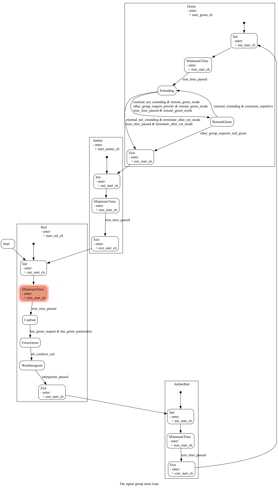
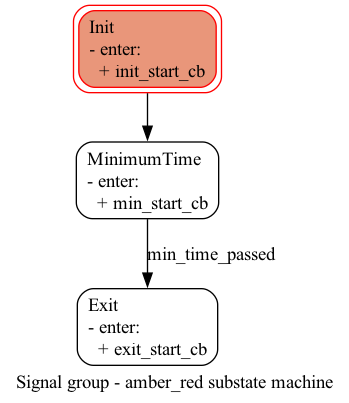
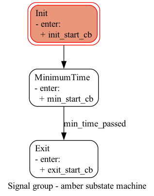
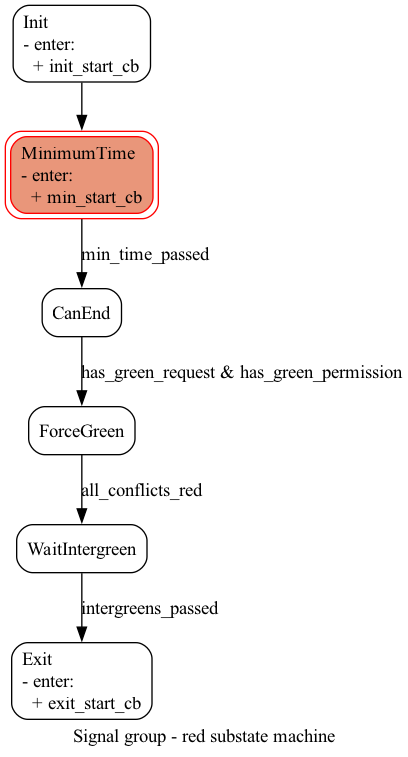
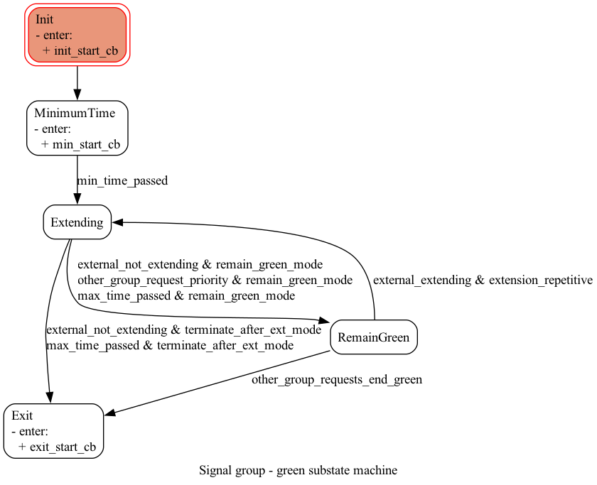

# Signal group operation

Each signal group (`SignalGroup`) is implemented as a state machine. That top-level
state machine has four states - Red, AmberRed, Green and Amber - and each of these
states is itself a nested state machine (a "substate machine") that governs what
happens while the signal group is in that phase.

```
Red -> AmberRed -> Green -> Amber -> Red -> ...
```

## Creating the state diagrams

The diagrams in this document are generated directly from the `transitions`-based
state machine implementation in `signal_group.py`, so they always reflect the
actual code rather than a hand-drawn approximation of it.

From the repository root, with a controller config file (e.g. one of the files
under `models/`, or your own):

```
mkdir -p tmp

# Full ring: all four phases in one diagram
pipenv run python services/control_engine/src/signal_group.py --conf-file models/test/simple/contr.json

# One diagram per phase (Red, AmberRed, Green, Amber)
pipenv run python services/control_engine/src/signal_group.py --submachines --conf-file models/test/simple/contr.json
```

The full ring is written to `tmp/ring.png`, and the per-phase diagrams to
`tmp/ring_red.png`, `tmp/ring_amber_red.png`, `tmp/ring_green.png` and
`tmp/ring_amber.png`. It always diagrams the first signal group listed under
`controller.signal_groups` in the given config file.

## Operation

### Full ring



The signal group cycles through Red, AmberRed, Green and Amber in a fixed order -
there is no other possible sequence. Each of the four phases is its own nested
state machine, shown individually below.

Every arrow in the diagrams below is a `next_state` transition. Where an arrow
has no label, the transition is unconditional (it fires as soon as the
previous state's entry logic runs); where it has a label, that label is the
guard condition that must become true before the transition fires. Making
these conditions explicit here - even for the simple phases - is meant to
match exactly what the diagrams show, since it's easy to assume a phase like
AmberRed is "just a timer" without naming what actually ends it.

### AmberRed



AmberRed is one of the simple phases: `Init` moves unconditionally to
`MinimumTime`, which runs a minimum time that, in this phase, is also its
maximum time. `MinimumTime` moves to `Exit` once the `min_time_passed`
condition becomes true, ending the phase.

### Amber



Amber works the same way as AmberRed: `Init` moves unconditionally to
`MinimumTime`, and `MinimumTime` moves to `Exit` once `min_time_passed` is
true - again, minimum time and maximum time are the same here.

### Red



Red is more complex than the other two fixed-time phases:

- `Init` moves unconditionally to `MinimumTime`, same as AmberRed and Amber.
- `MinimumTime` moves to `CanEnd` once `min_time_passed` is true.
- `CanEnd` moves to `ForceGreen` once `has_green_request & has_green_permission`
  is true - i.e. the signal group has a green request and the controller has
  given it permission to go green.
- In `ForceGreen`, the controller attempts to end any conflicting green
  groups. `ForceGreen` moves to `WaitIntergreen` once `all_conflicts_red` is
  true, meaning those conflicting groups have actually turned red.
- `WaitIntergreen` is the all-red time; it moves to `Exit`, ending the Red
  phase, once `intergreens_passed` is true.

### Green



Green starts the same way as the other phases, but what happens after the
minimum time depends on configuration (the `green_end` setting) as well as
the status of external signals (extensions):

- `Init` moves unconditionally to `MinimumTime`, same as the other phases.
- `MinimumTime` moves to `Extending` once `min_time_passed` is true. Every
  green phase always passes through `Extending`, regardless of mode.
- From `Extending`, what happens next depends on `green_end`:
  - In **"terminate after ext" mode** (`terminate_after_ext_mode`), green
    always stops when either the extensions end
    (`external_not_extending & terminate_after_ext_mode`) or the maximum
    green time is reached (`max_time_passed & terminate_after_ext_mode`) -
    both move straight to `Exit`.
  - In **"remain green" mode** (`remain_green_mode`), `Extending` moves to
    `RemainGreen` instead of `Exit` - in this mode the phase never exits
    directly from `Extending`. This happens on any of three conditions:
    extensions have ended (`external_not_extending & remain_green_mode`),
    another group has priority (`other_group_request_priority &
    remain_green_mode`, e.g. a public transport priority request), or the
    maximum time has passed (`max_time_passed & remain_green_mode`).
- `RemainGreen` moves to `Exit` once `other_group_requests_end_green` is
  true - in practice, a conflicting group wants to start its own green and
  cannot do so until this group ends its green.
- If `extension_repetitive` mode is on and an external extension restarts
  (`external_extending & extension_repetitive`), `RemainGreen` can also
  move back to `Extending`.

## Interfaces

Signal groups generally operate independently of each other, and change state
automatically within `tick()` (`SignalGroup.tick()`, `signal_group.py`)
whenever their conditions are met - `tick()` simply calls `next_state()` on
every time step, which fires whichever `next_state` transition (if any) has
its guard condition currently true.

Some of these conditions are purely clock-driven, such as `min_time_passed`
and `intergreens_passed` above. Many others, however, depend on external
input variables that get set from outside the state machine - namely:

- **Request green** - whether there is demand for green time for this group.
  Exposed as the `SignalGroup.request_green` property (backed by
  `_request_green`), set from outside the group (e.g. by detections). Read by
  the `has_green_request()` condition function, which is what actually feeds
  the `CanEnd -> ForceGreen` transition in the Red substate machine.
- **Extend** - whether there is demand to extend the green for this group.
  This isn't a plain flag on `SignalGroup` itself: it comes from an external
  extender object - `SignalGroup.extender` (an `Extender`) and/or
  `SignalGroup.e3extender` (an `e3Extender`), both defined in `extender.py` -
  each of which exposes its own `extend` property. The `external_extending()`
  condition in the Green substate machine (`VehicleActuated`) reads
  `self.group.extender.extend` and `self.group.e3extender.extend` and is true
  if either extender is requesting an extension.
- **Permission to go green** - whether the traffic controller allows this
  group to start green if it has a request. This exists to coordinate the
  order in which groups go green when several of them want to at the same
  time. Exposed as the `SignalGroup.permit_green` property (backed by
  `_permit_green`), set by the controller. Read by the `has_green_permission()`
  condition function, alongside `has_green_request()`, for the same
  `CanEnd -> ForceGreen` transition.
